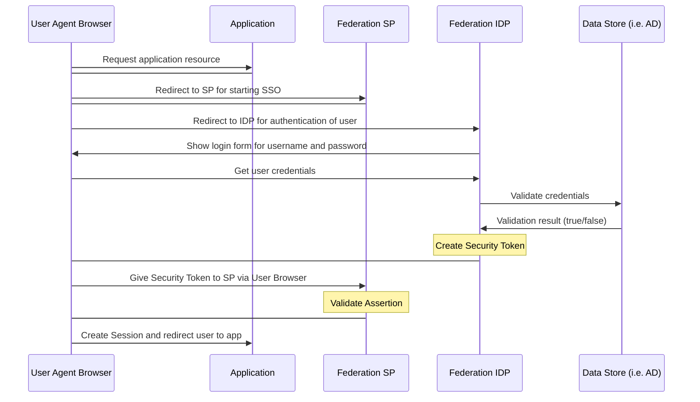

# ePI - electronic Product Information

### Overview
Please find information about setting up the ePI application (including the ePI-API) [here](https://www.google.com) (soon)<br>
and the OpenAPI documentation with testing capabilites (Swagger UI) [here](https://app.swaggerhub.com/apis-docs/lukas.osterheider/PharmaLedger_ePI/).

Contact for further questions: Sînică Alboaie (sinica.alboaie@axiologic.net)

### Table of contents
- [ePI - electronic Product Information](#epi---electronic-product-information)
    + [Overview](#overview)
    + [Table of contents](#table-of-contents)
  * [API URL](#api-url)
  * [Verification and Authentication](#verification-and-authentication)
  * [Single Sign On (SSO) with OAuth](#single-sign-on--sso--with-oauth)
    + [Overview](#overview-1)
    + [Prerequisite](#prerequisite)
      - [1. Getting tenant and client ID for ePI application](#1-getting-tenant-and-client-id-for-epi-application)
      - [2. Source code modification](#2-source-code-modification)
  * [Fields and Data Types](#fields-and-data-types)
  * [Callback URL](#callback-url)
  * [Buffering](#buffering)
  * [Try it out](#try-it-out)
    + [Swagger](#swagger)
    + [Postman](#postman)
  * [Glossary](#glossary)

## API URL
After successfully setting up the ePI-API it is available through a link which follows the following structure:

```
https://{serverPath}/mappingEngine/{epiDomain}/{companyVaultDomain}
E.g.: https://epi-singapore-dev.535161841476.cloud.bayer.com/mappingEngine/epipoc/vault.my-company
(local installation: https://localhost:8080/mappingEngine/epi/default)
```
## Verification and Authentication

In order to authenticate API-requests you need to use a valid token. This token will be sent with the API requests.
Tokens are generated in the enterprise wallet specific for each user. After logging in you can find the token under the tab "User as Holder" called "Wallet Identifier". The access rights can be permitted to a specific user in the demiurge wallet.
When sending API-requests the token needs to be added in the header of the request. The name of the header variable is "token" and the value is the wallet identifier.

## Single Sign On (SSO) with OAuth

### Overview

Single Sign On (SSO) services protocol used is oAuth for connection.  Federation SSO uses a trust model where the application trusts a message signed by the SSO server.  This removes the application from having to directly validate the user's ID & password against LDAP/Active Directory.

Authentication vs. Authorization:
Authentication and authorization are the security measures taken in -order to protect data and systems.  Authentication is the process of verifying the person’s identity who is attempting to access the system.  Authorization is the responsibility of the application owner and is a crucial part of checking the privileges or access list for which the person is authorized.
An overview of High-level flow is provided below:



### Prerequisite
-	Access to Identity Provider such as Azure AD
-	Epi-workspace 

To enable SSO in application, application need to have tenant-client ID and modify epi-workspace source code as explained in below two steps. This document is prepared assuming that Azure being used for ePI application registration for tenant and client ID:

#### 1. Get values for ePI application

After [creating a new app in Azure](https://docs.microsoft.com/en-us/azure/active-directory/develop/quickstart-register-app) you can find the necessary values for the source code modification here:

In the Azure Service "App registration":
<details>
<summary>
    clientId
</summary>
    

</details>

<details>
<summary>
    tenantID (oauthJWKSEndpoint, issuer, authorizationEndpoint, tokenEndpoint, logoutUrl)
</summary>
   

</details>

<details>
<summary>
    scope
</summary>
    
add a [new scope](https://docs.microsoft.com/en-us/azure/active-directory/develop/quickstart-configure-app-expose-web-apis)
    

</details>
 
<details>
<summary>
    redirectPath (main application url + "/?root=true")
</summary>
    

</details>

<details>
<summary>
    postLogoutRedirectUrl (main application url + "/?logout=true")
</summary>


</details>

<details>
<summary>
    clientSecret
</summary>


</details>

In the Azure Service "Enterprise Applications":

Add members in the Users and groups section of the Enterprise applications in Azure. Only members that've been added here can access the application with SSO.
<details>
<summary>
    Users and groups
</summary>
    

</details>


#### 2. Source code modification
[apihub.json helmchart location](https://github.com/PharmaLedger-IMI/helmchart-ethadapter/blob/master/charts/epi/templates/_configmap-config.tpl)
- Apihub-root/external-volume/config/apihub.json:
     -	Keep ‘true’ value for flags: ‘enableOAuth’ and ‘serverAuthentication’
     -	Keep ‘false’ value for flag: ‘enableLocalhostAuthorization’ if your setup is in the cloud. Keep 'true' if setup is local.
     -	Modify Tenant ID value for flags: ‘oauthJWKSEndpoint’, ‘issuer’, ‘authorizationEndpoint’, ‘tokenEndpoint’ and ‘logoutUrl’.
     -	Modify Client ID for flags: ‘clientId’ and ‘scope’.
-	Trust Loader evironment settings for SSO
     -	epi-workspace/trust-loader-config/demiurge-wallet/loader/environment.js: modify ‘mode’ value From ‘dev-secure’ To ‘sso-pin’.
     -	epi-workspace/trust-loader-config/dsu-fabric-wallet/loader/environment.js: modify ‘mode’ value From ‘dev-secure’ To ‘sso-direct’.
- Patient Wallet configuration to skip SSO:
     - •	Apihub-root/external-volume/config/apihub.json: In ‘skipOAuth’ section add below three values<br>"/leaflet-wallet/",<br>"/directory-summary/",<br>"/iframe/"
- In your SSO provider application like Azure:
     - Create a client secret key and update same in flag 'clientSecret' in apihub.json

Note: You can find an example of the apihub.json in this repository [here](https://github.com/PharmaLedger-IMI/api-documentation/blob/simon-epi-fgt/epi/apihub_having_sso_configuration.json).<br>

:warning:Caution: In the newest version we use a server sided sso implementation. The description of steps above should be sufficient. If you for any reason want to implement client side configuration, please check for the deprecated configuration steps below.

<details>
<summary>Click to expand for old client sided sso implementation. Outdated!</summary>

-	apihub-root/external-volume/config/oauthConfig.js:
     - Keep ‘oauthEnabled’ to false
     - Modify tenant id (3e7449a0-8ac3-426b-81b8-cd89c85cbe8c) in issuer, authorizationEndpoint and tokenEndpoint as per your tenant id value.
     - Modify client id (b4108e3e-0a5b-4ee8-b2ea-7c7e1c143a97) in clientId, scope as per your client ID value.
- apihub-root/external-volume/config/apihub.json:
     - Keep ‘enableOAuth’ and ‘enableLocalhostAuthorisation’ to true
     - Modified tenant id in ‘oauthJWKSEndpoint’

</details>

To check, build server locally and then using tunneling access ePI home page and it should show screen for SSO.


## User Management & Shared Enclaves

- How to manage the same data with multiple users as well as the company System of Record

## Fields and Data Types
There are three different types of requests: 
- batch
- product
- leaflet (split into basis and images)

Please find the request documentation [here]()

and the detailed fields and data type specification [here](https://github.com/PharmaLedger-IMI/api-documentation/blob/6895ba69a1065dfdbb81a982dc7418a73f7dca42/fgt/schema/product_create.json).

## Callbacks
Callbacks are handled by the mapping engine which gets set up by setting up the ePI-Workspace.
After the setup the callbacks will be by default sent to an url with the following structure:
```
https://{serverPath}/mappingEngine/{domain}/{subdomain}/saveResult
E.g.: https://epi-singapore-dev.535161841476.cloud.bayer.com/mappingEngine/epipoc/vault.my-company/saveResult
```

You can see the callbacks in the Enterprise Wallet under Products->Import->View Responses
<details>
<summary>Click to expand for a visual guide on where to find the callbacks.</summary>
<p>
After logging in to the Enterprise Wallet:


1. Select Product in the menu on the left side.

2. Next, select Import on the top of the page.

3. Then click on View Responses.

<p/>
</details>

## Buffering
Buffering gets handled by the mapping engine which is set up by setting up the ePI-Workspace.
An embedded database is used to store messages before they are processed.
There shouldn't be any speed and storage limitations with the current workload of the system. 
In the current state messages should get processed almost instantly.

## Try it out

### Swagger
Swagger is a collection of open source tools to design, build, document, and use HTTP web services (also called HTTP API or REST-like API).

Find the current openapi documentation in Swagger and ready for testing [here](https://www.google.com).

### Postman
Postman is an API platform for building and using APIs. 

You can install Postman from their website [here](https://www.postman.com/downloads/).
After opening Postman you can [click on import](https://learning.postman.com/docs/integrations/available-integrations/working-with-openAPI/) and select the openapi documentation.

For further details refer to the [Postman Docs](https://learning.postman.com/docs/getting-started/introduction/):
- [Navigating Postman](https://learning.postman.com/docs/getting-started/navigating-postman/)
- [Send your first request](https://learning.postman.com/docs/getting-started/sending-the-first-request/)
- [more](https://learning.postman.com/docs/getting-started/introduction/)

## Glossary
|Abbreviation|Meaning|
|------------|-------|
|IAM|Identity & Access Management|
|IDP|Identity Provider|
|LDAP|Light Weight Directory Access Protocol|
|OAuth|Open Authorization Protocol|
|PAM|Privileged Access Management|
|SP|Service Provider|
|SSO|Single Sign On|
