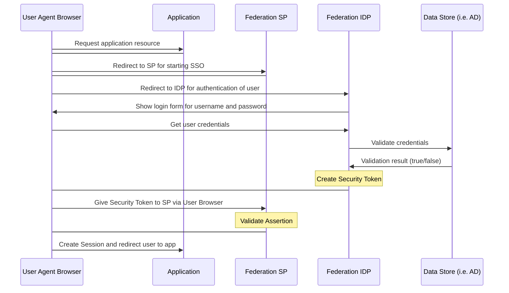

# ePI - electronic Product Information

## Overview
Please find information about setting up the ePI-API [here](https://www.google.com) (soon)<br>
and the openapi documentation with testing capabilites [here](https://www.google.com) (soon).

Contact for further questions: Sînică Alboaie (sinica.alboaie@axiologic.net)

## Table of contents
- [ePI - electronic Product Information](#epi---electronic-product-information)
  * [API URL](#api-url)
  * [Verification and Authentication](#verification-and-authentication)
  * [Single Sign On (SSO) with OAuth](#single-sign-on--sso--with-oauth)
    + [Overview](#overview)
    + [Prerequisite](#prerequisite)
      - [1. Getting tenant and client ID for ePI application](#1-getting-tenant-and-client-id-for-epi-application)
      - [2. Source code modification](#2-source-code-modification)
  * [Fields and Data Types](#fields-and-data-types)
  * [Callback URL](#callback-url)
  * [Buffering](#buffering)
  * [Try it out](#try-it-out)
    + [Swagger](#swagger)
    + [Postman](#postman)

## API URL
After successfully setting up the ePI-API it is available through a link which follows the following structure:

```
https://{serverPath}/mappingEngine/{epiDomain}/{companyVaultDomain}
E.g.: https://epi-singapore-dev.535161841476.cloud.bayer.com/mappingEngine/epipoc/vault.my-company
```
## Verification and Authentication

In order to authenticate API-requests you need to use a valid token. This token will be sent with the API requests.
Tokens are generated in the enterprise wallet specific for each user. After logging in you can find the token under the tab "User as Holder" called "Wallet Identifier". The access rights can be permitted to a specific user in the demiurge wallet.
When sending API-requests the token needs to be added in the header of the request. The name of the header variable is "token" and the value is the wallet identifier.

## Single Sign On (SSO) with OAuth

### Overview

Single Sign On (SSO) services protocol used is oAuth for connection.  Federation SSO uses a trust model where the application trusts a message signed by the SSO server.  This removes the application from having to directly validate the user's ID & password against LDAP/Active Directory.

Authentication vs. Authorization:
Authentication and authorization are the security measures taken in -order to protect data and systems.  Authentication is the process of verifying the person’s identity who is attempting to access the system.  Authorization is the responsibility of the application owner and is a crucial part of checking the privileges or access list for which the person is authorized.
An overview of High-level flow is provided below:



### Prerequisite
-	Access to Identity Provider such as Azure LDAP
-	Epi-workspace 

To enable SSO in application, application need to have tenant-client ID and modify epi-workspace source code as explained in below two steps. This document is prepared assuming that Azure being used for ePI application registration for tenant and client ID:

#### 1. Getting tenant and client ID for ePI application

| Step  | Location |
| ------------- | ------------- |
| 1. Refer to the two links below for registering your ePI in Azure Active Directory:<br>[How to get Azure api credentials](https://www.inkoop.io/blog/how-to-get-azure-api-credentials/)<br>[How to find tenant](https://docs.microsoft.com/en-us/azure/active-directory/fundamentals/active-directory-how-to-find-tenant)| As per your organization  |
| 2. Put custom scope as explained in the following link:<br>[Quickstart app expose web apis](https://docs.microsoft.com/en-us/azure/active-directory/develop/quickstart-configure-app-expose-web-apis) | As per your organization  |
| 3. Call back URL value in Azure registration must match with:<br>3.1 ‘redirectPath’ value in apihub.json  ‘http://localhost:8080/?root=true’<br>3.2 ‘postLogoutRedirectUrl’ value in apihub.json  ‘http://localhost:8080/?logout=true’ | Common for all and as defined in apihub.json  |

#### 2. Source code modification
- Apihub-root/external-volume/config/apihub.json:
     -	Keep ‘true’ value for flags: ‘enableOAuth’, ‘enableLocalhostAuthorization’, and ‘serverAuthentication’
     -	Modify Tenant ID value for flags: ‘oauthJWKSEndpoint’, ‘issuer’, ‘authorizationEndpoint’, ‘tokenEndpoint’ and ‘logoutUrl’.
     -	Modify Client ID for flags: ‘clientId’ and ‘scope’.
-	Trust Loader evironment settings for SSO
     -	epi-workspace/trust-loader-config/demiurge-wallet/loader/environment.js: modify ‘mode’ value From ‘dev-secure’ To ‘sso-pin’.
     -	epi-workspace/trust-loader-config/dsu-fabric-wallet/loader/environment.js: modify ‘mode’ value From ‘dev-secure’ To ‘sso-direct’.
- Patient Wallet configuration to skip SSO:
     - •	Apihub-root/external-volume/config/apihub.json: In ‘skipOAuth’ section add below three values<br>"/leaflet-wallet/",<br>"/directory-summary/",<br>"/iframe/"
- In your SSO provider application like Azure:
     - Create a client secret key and update same in flag 'clientSecret' in apihub.json

Note: Below client configuration is not required. Make sure that ‘oauthEnabled’ flag is ‘false’ in oauthConfig.js

<details>
<summary>Click to expand</summary>

-	apihub-root/external-volume/config/oauthConfig.js:
     - Keep ‘oauthEnabled’ to false
     - Modify tenant id (3e7449a0-8ac3-426b-81b8-cd89c85cbe8c) in issuer, authorizationEndpoint and tokenEndpoint as per your tenant id value.
     - Modify client id (b4108e3e-0a5b-4ee8-b2ea-7c7e1c143a97) in clientId, scope as per your client ID value.
- apihub-root/external-volume/config/apihub.json:
     - Keep ‘enableOAuth’ and ‘enableLocalhostAuthorisation’ to true
     - Modified tenant id in ‘oauthJWKSEndpoint’

</details>

- To check, build server locally and then using tunneling access ePI home page and it should show screen for SSO.


## Fields and Data Types
There are three different types of requests: 
- batch
- product
- leaflet (split into basis and images)

Please find the request documentation [here]()

and the detailed fields and data type specification [here](https://github.com/PharmaLedger-IMI/api-documentation/blob/6895ba69a1065dfdbb81a982dc7418a73f7dca42/fgt/schema/product_create.json).

## Callback URL

(soon)

## Buffering

(soon)

## Try it out

### Swagger
Swagger is a collection of open source tools to design, build, document, and use HTTP web services (also called HTTP API or REST-like API).

Find the current openapi documentation in Swagger and ready for testing [here](https://www.google.com).

### Postman
Postman is an API platform for building and using APIs. 

You can install Postman from their website [here](https://www.postman.com/downloads/).
After opening Postman you can [click on import](https://learning.postman.com/docs/integrations/available-integrations/working-with-openAPI/) and select the openapi documentation.

For further details refer to the [Postman Docs](https://learning.postman.com/docs/getting-started/introduction/):
- [Navigating Postman](https://learning.postman.com/docs/getting-started/navigating-postman/)
- [Send your first request](https://learning.postman.com/docs/getting-started/sending-the-first-request/)
- [more](https://learning.postman.com/docs/getting-started/introduction/)

## Glossary
|Abbreviation|Meaning|
|------------|-------|
|IAM|Identity & Access Management|
|IDP|Identity Provider|
|LDAP|Light Weight Directory Access Protocol|
|OAuth|Open Authorization Protocol|
|PAM|Privileged Access Management|
|SP|Service Provider|
|SSO|Single Sign On|
